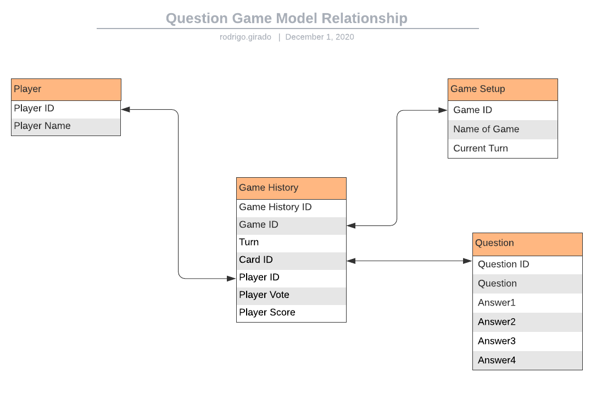

<h1>MVP for board game on Django</h1>

<h2>Summary</h2>
Multiplayer game, where each player takes turns drawing a card from a pile, which asks if that player was X what X would they be and lists a number of Xs to vote on, players that voted on the selection with the most votes get a point.

The idea is to build a prototype that doesn’t need to handle the operation in multiplayer to begin with, but can at least handle a random card being drawn, voting on a list and tallying those votes, attributing them to the different players.

<h2>How to use this file</h2>


<h2>Design</h2>
detailed below are all the steps to the creation of the game in Django

**Step 1** Create a model that holds all the players, that can be interacted with inside the page itself, to add or subtract players.

Attributes of this model:
- Name: str
- Score: [int]


**Step 2** Create a model that holds all the cards with all their options and a mechanism to draw one at a time at random without repeating. Attributes for each card:
- question: the question itself should be written with the assumption that it begins with “if {{Player’s name}} was a “ so the questions would look like this “TV show, which TV show would they be” since the line displaying the player will be easier to code if it’s not in the middle of the string.
- option1
- option2
- option3
- option4

**Step 3** Game Setup
- Name of the Game: str(unique) identifies the name of the game.
- Last Turn: int - identifies the current turn.

**Step 4** Create Game History Model

Game_History
- game_id: int - identifies the game
- turn: int - identifies the turn number within the game 
- card_id: int - identifies the card chosen for this turn within the game
- player_id: int - identifies the player who voted in this turn
- player_vote: int - identifies the player's vote for this turn


Example, after turn 0 of game 1:

| game_id | turn | card_id | player_id | vote |
|---------|------|---------|-----------|------|
| 1       | 0    | 3       | 1         | 4    |
| 1       | 0    | 3       | 2         | 3    |
| 1       | 0    | 3       | 3         | 3    |
| 1       | 0    | 3       | 4         | 1    |

**Step 5** Create a page where a new game is selected or initialized
- Randomizes the cards.
- Randomizes the players.

**Step 6** Create a page where a new card is displayed from the randomized list of cards and where each “player” votes on their choice
- In MPV, this is entered by a single "proctor" user. (admin user).
- Each player in the game gets a vote to select one of the options on the selected card.
- Button to submit votes


<h3>How the process works</h3>

Welcome page displays 
- List of all games in Game Setup model
- Data input for a new game name
- Button to create a new game based on the name provider and the total number of players currently in the Player model

game_idxxx/ page displays
- The current turn is displayed on the top left corner of the page
- Display Question.question from the Game History model matching the current game ID
- One entry per player
- One radio button per answer to be selected
- Button to submit votes and tally the results before moving to the next question.



Research radio buttons.

- Project plan ✓
- Create a new Django Project. ✓
- Create a new Virtual Environment. ✓
- Create two new tables with each one of the elements. ✓
- Create the migrations and migrate tables. ✓


- Create a randomized list of card ✓
- Display one card at a time ✓


Python Collections
dict
key, value mapping
UNORDERED
set
key, no value
UNORDERED 
list 
ordered collection

questions = [ q1, q2, q3, …, qn

how to shuffle a list in Python? 


Building Querries on Django.
Submitting forms on Django

``` bash
. game_env/bin/activate
```

to run the environment with python 3 installed
